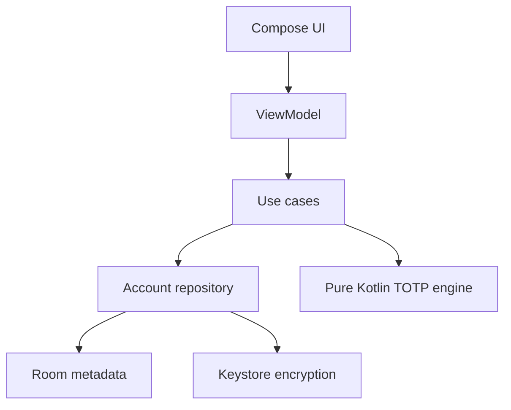

# KAuthenticator implementation plan

## 1. Mục tiêu

Xây dựng ứng dụng Android tạo mã xác thực TOTP tương thích với QR `otpauth://`, hoạt động offline và bảo vệ shared secret bằng Android Keystore.

MVP không cần tài khoản người dùng hoặc backend. Cloud sync, Google Authenticator migration và HOTP được tách thành các phase sau để không mở rộng bề mặt tấn công quá sớm.

## 2. Feature scope

### MVP

1. Danh sách authenticator accounts
   - Hiển thị issuer, account name, OTP và vòng đếm ngược.
   - Tìm kiếm, sắp xếp, copy OTP.
   - Edit label và delete account có confirmation.
2. Thêm account
   - Quét QR chuẩn `otpauth://totp`.
   - Nhập secret thủ công.
   - Validate issuer, account name, Base32 secret, algorithm, digits và period.
3. TOTP
   - Hỗ trợ HMAC-SHA1, HMAC-SHA256 và HMAC-SHA512.
   - Hỗ trợ 6 hoặc 8 digits và period tùy chỉnh; mặc định 30 giây.
   - Dùng thời gian hệ thống, không yêu cầu network.
4. Lưu trữ an toàn
   - Metadata lưu bằng Room.
   - Secret mã hóa AES-GCM; wrapping key được tạo và giữ trong Android Keystore.
   - Không log secret, QR payload hoặc OTP.
   - Tắt Android backup trong MVP để tránh database được restore mà không có Keystore key tương ứng.
5. Security UX
   - Tùy chọn khóa ứng dụng bằng biometric/device credential.
   - Tùy chọn chặn screenshot.
   - Clipboard được tự xóa nếu nội dung chưa bị ứng dụng khác thay đổi.
6. Settings
   - Theme system/light/dark.
   - Bật/tắt biometric lock và screenshot protection.
   - Hiển thị cảnh báo khi thời gian tự động của thiết bị đang tắt.

### Sau MVP

- Export/import backup được mã hóa bằng password-derived key.
- Import nhiều account từ Google Authenticator migration QR.
- HOTP counter-based accounts.
- Encrypted sync giữa các thiết bị. Tính năng này cần threat model và thiết kế key recovery riêng trước khi implement.
- Tablet/foldable adaptive layout và accessibility refinement.

## 3. Kiến trúc

Sử dụng unidirectional data flow, repository pattern và dependency injection. UI chỉ nhận state và phát action; thuật toán TOTP không phụ thuộc Android để có thể unit test trên JVM.



### Module dự kiến

| Module | Trách nhiệm |
| --- | --- |
| `app` | Application, navigation root, DI wiring |
| `core:model` | Domain models và validation types |
| `core:otp` | Base32, `otpauth` parser, HOTP/TOTP engine, time abstraction |
| `core:security` | Keystore key lifecycle, AES-GCM encryption, biometric gate |
| `core:database` | Room entities, DAO, migrations và repository implementation |
| `core:designsystem` | Theme và reusable Compose components |
| `feature:accounts` | Account list, search, edit, delete, copy |
| `feature:addaccount` | QR scanner và manual entry |
| `feature:settings` | Security và appearance settings |

Tách module sẽ thực hiện theo từng phase, tránh tạo toàn bộ module rỗng ngay khi init project.

### Thành phần domain chính

```kotlin
data class TotpAccount(
    val id: String,
    val issuer: String,
    val accountName: String,
    val secret: SecretReference,
    val algorithm: TotpAlgorithm,
    val digits: Int,
    val periodSeconds: Int,
)
```

`SecretReference` không expose plaintext secret cho UI. Repository chỉ giải mã trong thời gian ngắn khi TOTP engine cần tính OTP.

## 4. Implementation phases

### Phase 0 — Project foundation

- Khởi tạo Compose project, package `tm.khang.kauthenticator`.
- Thiết lập version catalog, JDK 17, CI, lint và test tasks.
- Thêm coding conventions và pull-request checks.

Điều kiện hoàn thành: `lintDebug`, `testDebugUnitTest` và `assembleDebug` thành công.

### Phase 1 — Pure Kotlin OTP core

- Implement strict Base32 decoder.
- Parse và normalize `otpauth://totp` URI.
- Implement HOTP dynamic truncation và TOTP time counter.
- Inject `Clock` để test chính xác ở time boundaries.
- Trả lỗi typed thay vì exception/message tùy ý.

Điều kiện hoàn thành: tất cả RFC test vectors và URI validation tests pass; module không phụ thuộc Android.

### Phase 2 — Encrypted persistence

- Tạo Room schema cho account metadata và encrypted secret envelope.
- Tạo AES-256-GCM key bằng Android Keystore.
- Mỗi secret dùng IV ngẫu nhiên riêng; lưu ciphertext, IV và schema version.
- Implement repository và database migration test.
- Xử lý rõ trường hợp key bị invalidated hoặc data không giải mã được.

Điều kiện hoàn thành: encryption round-trip, tamper detection, process restart và Room migration tests pass trên emulator/device.

### Phase 3 — Add account

- Camera permission flow và QR scanner.
- Parse QR bên ngoài UI để scanner library không chạm vào domain logic.
- Manual entry form với validation theo field.
- Detect duplicate account nhưng cho phép người dùng quyết định replace hoặc keep both.

Điều kiện hoàn thành: thêm được account từ các URI SHA1/SHA256/SHA512 hợp lệ; invalid QR không ghi dữ liệu.

### Phase 4 — Account list

- Render OTP từ state với countdown lấy từ timestamp, không decrement một counter dễ drift.
- Search, sort, copy, edit và delete.
- Chỉ update phần OTP/countdown cần thiết để tránh recompose toàn bộ list mỗi giây.
- Hỗ trợ empty state và process recreation.

Điều kiện hoàn thành: UI tests cho empty/list/search/delete và time-boundary behavior pass.

### Phase 5 — Security hardening và release readiness

- Biometric/device credential gate, screenshot protection và clipboard clearing.
- Accessibility, TalkBack labels, large font và dark theme review.
- Dependency/license review, release R8 rules và signed release build documentation.
- Threat-model review trước khi thêm export, sync hoặc analytics.

Điều kiện hoàn thành: security checklist, lint, unit tests, instrumented tests và release build pass.

## 5. Test strategy

### Unit tests — bắt buộc

| Component | Cases chính |
| --- | --- |
| Base32 decoder | lowercase/uppercase, padding, whitespace policy, invalid alphabet, empty input |
| HOTP/TOTP engine | RFC 4226/6238 vectors, SHA1/256/512, 6/8 digits, leading zero, timestamps trước/sau boundary |
| `otpauth` parser | percent encoding, issuer in label/query, missing secret, unsupported type/algorithm/digits/period |
| Use cases | duplicate handling, sorting, validation, repository failures |
| ViewModels | initial/loading/content/error state và từng user action |

Không mock thuật toán cryptography. Test bằng vectors cố định và fake clock; mock/fake chỉ dùng tại I/O boundaries.

### Instrumented tests

- Android Keystore encrypt/decrypt round-trip.
- Ciphertext hoặc authentication tag bị sửa phải decrypt thất bại.
- Room DAO và schema migrations.
- Biometric state transitions bằng abstraction/fake phù hợp.
- Compose navigation, add/edit/delete và configuration change.

### Manual/security tests

- Quét QR từ nhiều provider phổ biến.
- Đặt sai thời gian thiết bị và kiểm tra cảnh báo.
- Backup/restore, clear data, uninstall/reinstall và Keystore invalidation.
- Screenshot, recent-app thumbnail và clipboard exposure.
- Airplane mode để xác nhận toàn bộ MVP hoạt động offline.

### CI quality gate

Mỗi pull request chạy:

```bash
./gradlew lintDebug testDebugUnitTest assembleDebug
```

Instrumented tests có thể chạy theo lịch hoặc trước release vì cần emulator.

## 6. Definition of done cho MVP

- Import được QR `otpauth://totp` và manual secret.
- OTP khớp RFC vectors và ít nhất ba provider thực tế.
- Secret không xuất hiện trong log, analytics, saved state hoặc UI semantics.
- Dữ liệu local được mã hóa và xử lý được key invalidation.
- App hoạt động offline sau khi cài đặt.
- Unit tests, lint, debug build và release build pass.
- Có tài liệu build, security decisions và giới hạn hiện tại.

## 7. Commit plan

1. `chore: initialize Android Compose project`
2. `docs: add authenticator implementation plan`
3. `feat: implement and test TOTP core`
4. `feat: add encrypted account persistence`
5. `feat: add QR and manual account enrollment`
6. `feat: add authenticator account list`
7. `feat: add app security settings`
8. `chore: harden and prepare release build`
